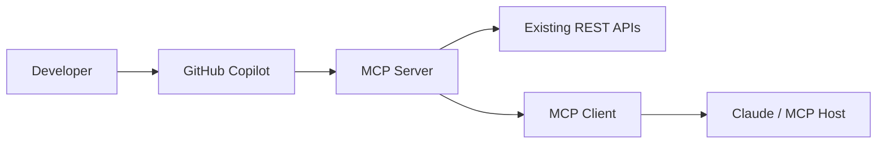
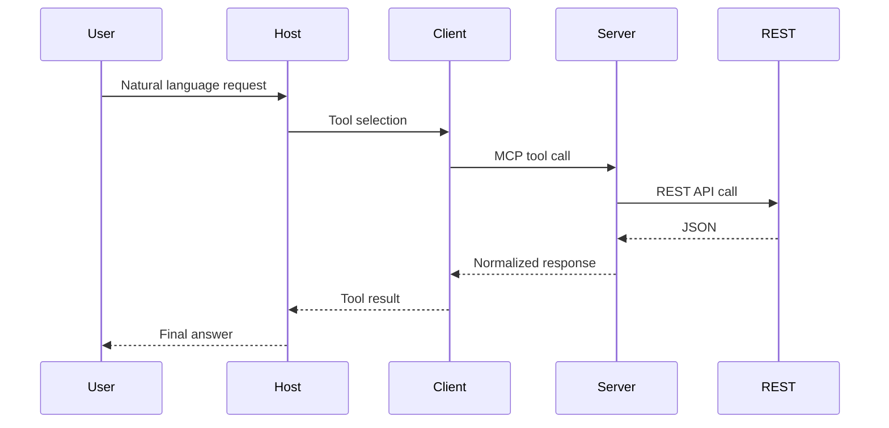

# GitHub Copilot–Driven MCP Implementation Plan

This document provides a **step‑by‑step, execution‑ready plan** for using **GitHub Copilot** to implement an **MCP Server**, integrate it with an **MCP Client**, and connect to existing **REST APIs**, following MCP best practices and enterprise governance principles.

---

## 1. Scope and Goals

**Objective**
- Use GitHub Copilot to accelerate MCP Server development
- Safely wrap existing REST APIs with MCP
- Integrate with MCP‑aware Hosts (Claude Desktop, Claude Agent SDK, etc.)

**Out of Scope**
- Modifying GitHub Copilot internals
- Replacing REST APIs
- Bypassing governance or access controls

---

## 2. High‑Level Architecture



---

## 3. Phase 0 – Prerequisites

### Required Tooling
- VS Code
- GitHub Copilot + Copilot Chat
- Python 3.10+ or Node.js 18+
- MCP SDK
- REST API credentials

### Workspace Setup
- Place MCP glossary and architecture notes in `README.md`
- Keep REST API schema docs in repository
- Enable Copilot Workspace context

---

## 4. Phase 1 – MCP Capability Design

### Step 1: Capability Mapping

Use Copilot Chat to analyze REST APIs:

```
Given these REST endpoints, help me define MCP tools, resources, and safety levels.
```

**Outcome**:
- Tools represent **business actions**
- Resources represent **agent‑explorable data**
- No CRUD leakage

---

### Step 2: MCP Interface Drafting

Prompt Copilot:
```
Draft MCP tool definitions in Python with safety hints.
```

Manually validate:
- Descriptions are intent‑based
- Correct read‑only vs destructive flags

---

## 5. Phase 2 – MCP Server Implementation

### Step 3: MCP Server Scaffold

Copilot prompt:
```
Create a minimal MCP server using the Python MCP SDK.
```

Target structure:
```
mcp-server/
│ server.py
│ rest_client.py
│ auth.py
│ README.md
```

---

### Step 4: REST Adapter Layer

Copilot assists with:
- HTTP client boilerplate
- Retry and timeout logic
- Response normalization

**Human responsibilities**:
- PII filtering
- Schema validation
- Error taxonomy

---

### Step 5: Safety & Governance Signals

Copilot prompt:
```
Add MCP safety metadata for all tools.
```

Verify:
- `readOnlyHint` on data fetches
- `destructiveHint` only on irreversible actions

---

## 6. Phase 3 – MCP Client Integration

### Key Rule

✅ You do NOT implement an MCP Client for GitHub Copilot.

MCP Clients already exist inside:
- Claude Desktop
- Claude Agent SDK
- Other MCP‑aware Hosts

Your responsibility:
- Start MCP Server
- Make tools discoverable
- Validate responses

---

### Step 6: Local Host Testing

Test flow:



---

## 7. Phase 4 – Using Copilot to Extend MCP

Copilot can be safely used to:
- Add new tools
- Improve normalization
- Add resources
- Generate tests

Copilot should NOT:
- Decide permissions
- Design workflows unsupervised

---

## 8. Phase 5 – REST API Integration Rules

### REST is unchanged

- MCP wraps REST
- Business logic stays in services
- MCP handles:
  - Auth abstraction
  - Safety metadata
  - Context normalization

---

## 9. Phase 6 – Security & Compliance Controls

Mandatory controls:
- Explicit tool permissions
- Human confirmation for destructive tools
- Audit logs of every MCP call
- Role‑based scoping
- Rate limits and timeouts

Copilot can draft checklists but **humans decide policies**.

---

## 10. Phase 7 – CI/CD Integration

Copilot can generate:
- GitHub Actions workflows
- Unit tests
- Mock REST servers

Recommended checks:
- Tool schema validation
- Safety flag verification
- Contract tests against REST mocks

---

## 11. What GitHub Copilot Is—and Is Not

| GitHub Copilot | MCP |
|---------------|-----|
| Code accelerator | Integration protocol |
| Suggests patterns | Defines runtime contract |
| Productivity tool | Security & safety layer |

---

## 12. 30–60 Day Rollout Plan

### Days 1–10
- One MCP server
- 2–3 read‑only tools
- Local Host testing

### Days 11–30
- Resources support
- One safe write tool
- Logging & audits

### Days 31–60
- CI/CD hardening
- Governance review
- Documentation rollout

---

## 13. Final Takeaway

> **GitHub Copilot accelerates MCP implementation, but humans own intent, safety, and governance.**

Treat MCP as a **capability layer**, not an API mirror.

---
