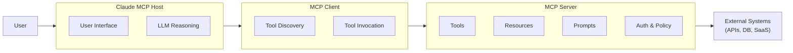
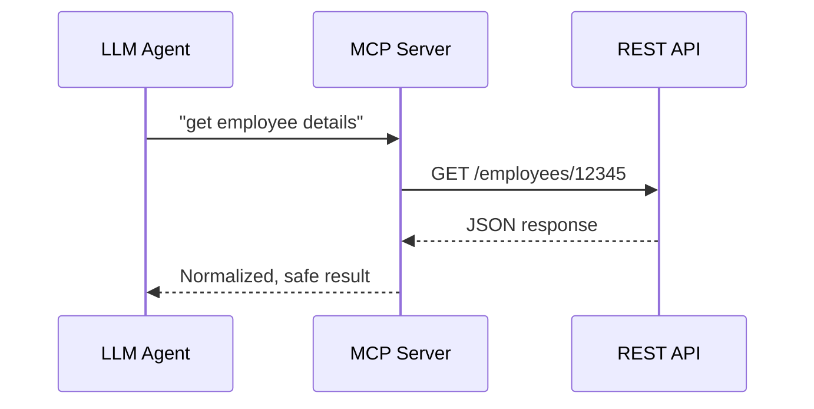
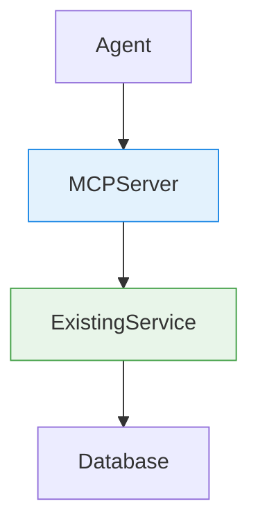
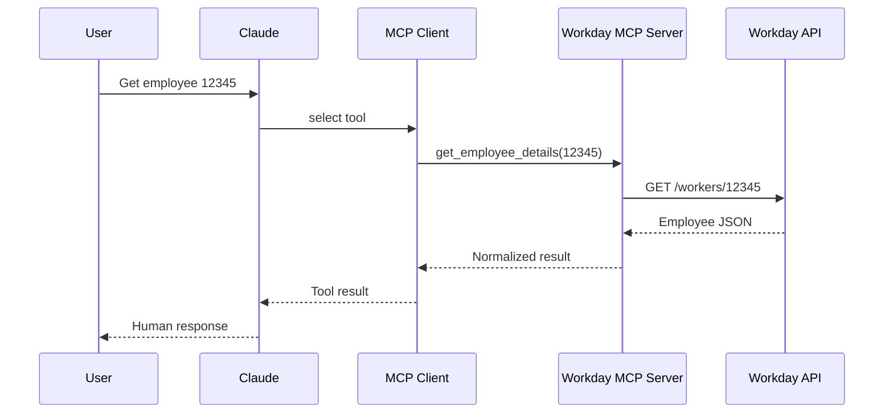

# MCP IMPLEMENTATION TUTORIAL

This document provides a **complete, end-to-end guide** to designing, building, and deploying a Model Context Protocol (MCP) implementation, based strictly on the discussion above and current MCP best practices.

---

## 1. What MCP Solves

MCP (Model Context Protocol) is an **open standard** for connecting AI models (Claude, ChatGPT, etc.) to real systems (APIs, databases, tools) in a **safe, semantic, and scalable way**.

Key problems MCP addresses:
- REST APIs are built for deterministic clients, not probabilistic agents
- Tool schemas are duplicated across every model integration
- Security, permissions, and intent are hard to express with raw endpoints

MCP introduces **capability-based access** rather than endpoint-based access.

---

## 2. Core MCP Architecture



---

## 3. MCP Primitives (Critical)

### Tools
Actions that cause effects.
- `get_employee_details`
- `submit_time_off_request`

Attributes:
- `readOnlyHint`
- `destructiveHint`

### Resources
URI-addressable data for exploration.
- `workday://employee/12345`
- `db://table/row`

### Prompts
Reusable workflows.
- PTO request flows
- Hiring checklists

---

## 4. MCP vs REST APIs



Key differences:
- MCP exposes **intent**, REST exposes **transport**
- MCP is **self-describing at runtime**
- MCP includes **agent safety metadata**

---

## 5. Converting a Microservice to MCP

### Recommended Pattern



Rules:
- Do NOT move business logic
- MCP = adapter + policy layer
- Expose **fewer, higher-level tools**

---

## 6. Example: Workday Employee Lookup



---

## 7. MCP Server Reference Implementation (Python)

```python
from mcp.server import Server
import requests

server = Server("workday-mcp")

@server.tool(
    name="get_employee_details",
    description="Retrieve employee details by ID",
    read_only=True
)
def get_employee_details(employee_id: str):
    response = requests.get(
        f"https://workday/api/workers/{employee_id}"
    )
    return response.json()

if __name__ == "__main__":
    server.run()
```

---

## 8. Claude MCP Host Options

| Host Type | Open Source | Notes |
|---------|------------|------|
| Claude Desktop | No | Official, easy setup |
| Claude Code | No | Dev‑focused |
| Claude Agent SDK | Partial | SDK public, runtime closed |
| Community Hosts (mcphost) | Yes | Fully open |

---

## 9. When to Implement Your Own MCP Host

✅ Build your own Host if:
- You need a custom UI
- You want full orchestration control
- You are building a platform

❌ Do NOT build a Host if:
- Claude Desktop meets your needs
- You only need tool access

---

## 10. Security & Governance Checklist

- ✅ Read-only first
- ✅ Explicit destructive actions
- ✅ User confirmations
- ✅ Audit logs for every tool call
- ✅ Field-level filtering

---

## 11. Common Anti‑Patterns

- Auto‑wrapping OpenAPI specs
- Exposing CRUD tools
- Dumping large JSON payloads
- Letting agents manage auth credentials

---

## 12. Recommended Learning Path

Week 1: Read-only MCP server
Week 2: Resources + normalization
Week 3: One safe write action
Week 4: Governance + sharing

---

## 13. Final Takeaway

> MCP is not "yet another API". It is a **semantic, safety-aware, agent integration layer**.

Build fewer tools. Make them meaningful. Let the agent reason.

---
